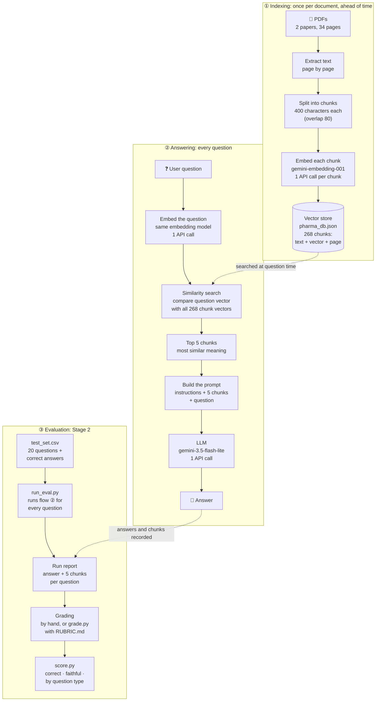

# How the pipeline works

Three flows. **Indexing** happens once per document, ahead of time. **Answering** happens for every
question. **Evaluation** (added in Stage 2) runs the answering flow over a fixed test set and scores it.
Numbers are for the current setup: two PDFs, chunk size 400 / overlap 80, top-k 5.

## What happens at each step, and the tradeoff it controls

| Step | What it does | Tradeoff it controls |
|---|---|---|
| **Split into chunks** | Cuts each page into ~400-character pieces | Small chunks = precise search but facts get cut in half; large = complete facts but more noise per chunk |
| **Embed** | Turns text into a list of numbers that captures its *meaning*, so similar meanings get similar numbers | Cost: one call per chunk at indexing; re-chunking means re-embedding everything |
| **Vector store** | Keeps every chunk's text, vector and page number | Storage grows with chunks (overlap 200 → 425 chunks; overlap 80 → 268) |
| **Embed the question** | Same model, so the question and chunks are comparable | Must be the same model used for indexing, or the comparison is meaningless |
| **Similarity search** | Scores every chunk by how close its meaning is to the question | Measures "same topic", not "contains the answer" (see Stage 3) |
| **Top 5 chunks** | Keeps the 5 best matches (top-k) | Higher k = more chance the answer is included, but more noise, cost and latency |
| **Build the prompt** | Instructions ("answer only from the context") + chunks + question | The instructions decide when the model says "I don't know" |
| **LLM** | Reads the chunks and writes the answer | Bigger model = better reasoning but slower, costlier, and smaller free quota |

**Where failures come from** (from the Stage 2 results): most failures happen at **similarity search**,
when the chunk with the answer isn't in the top 5. The model can only answer from what it's given.

**Per question:** 2 API calls (embed + LLM), about 2 seconds — 1 second search, 1 second answer.
